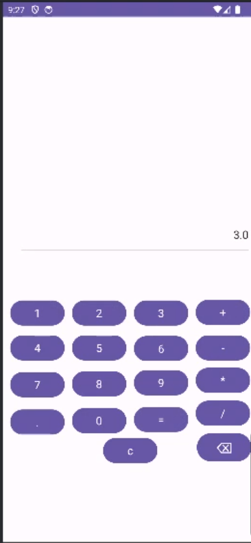

# Calculator

## Description

The Calculator App is a simple and user-friendly calculator application for performing basic arithmetic operations. It provides a convenient way to perform addition, subtraction, multiplication, and division calculations on your mobile device.

## Features

- Perform basic arithmetic operations: addition, subtraction, multiplication, and division.
- User-friendly interface with a numeric keypad and operation buttons.
- Clear button to erase the last input or clear the entire input.
- Calculate and display results in real-time.
- Easily accessible on mobile devices for quick calculations.

## Usage

1. Launch the Calculator App on your Android device.
2. Use the numeric keypad to enter numbers.
3. Tap the operation buttons (+, -, *, /) to perform calculations.
4. Tap the "=" button to see the result of your calculation.
5. To clear the input, use the "C" button to erase the last entry or the "CE" button to clear the entire input.
6. Enjoy the convenience of a simple and easy-to-use calculator app!

