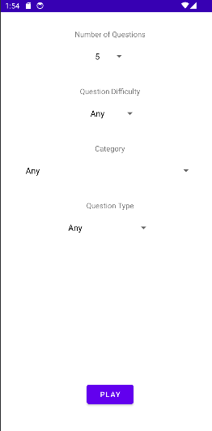
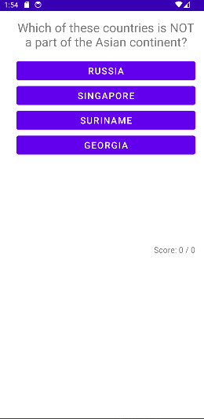

# Quiz Application

A quiz application to play along and get informed and test it while you play along.

## Features

- Trivia Quiz API Integration: The app fetches trivia questions from an external API to provide users with a diverse set of questions.

- Category Selection: Users can choose from different categories for their quiz questions, allowing for customized quizzes.

- Variable Question Count: Users can specify the number of questions they want in their quiz, making it flexible for short or long quizzes.

## Screenshots

