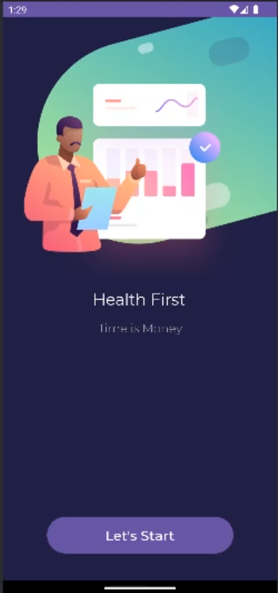
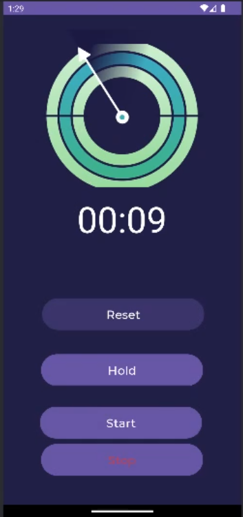

# Stop Watch
## Overview

The Stop Watch App is a simple yet versatile stopwatch application for Android devices. It allows users to measure elapsed time with features such as start, stop, pause, and reset. The app provides a user-friendly interface and smooth animations for a seamless experience.

## Features

- **Start:** Begin tracking elapsed time by clicking the "Start" button.
- **Pause:** Pause the timer if needed, and resume it when ready.
- **Stop:** Stop the timer and record the final elapsed time.
- **Reset:** Reset the timer to zero, ready for a new measurement.
- **Visual Feedback:** Enjoy animations that make using the stopwatch engaging.

