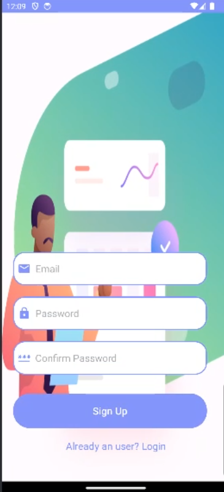
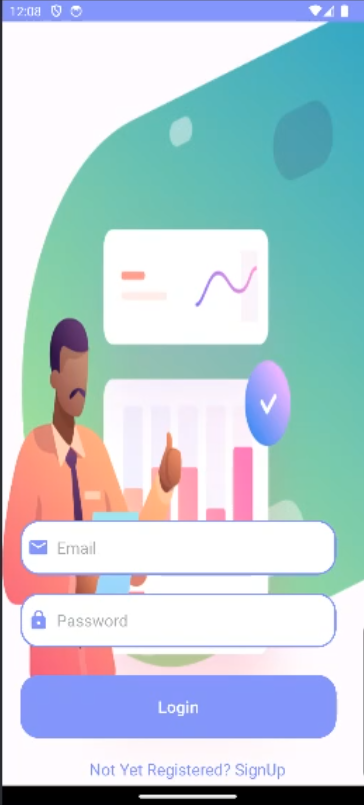
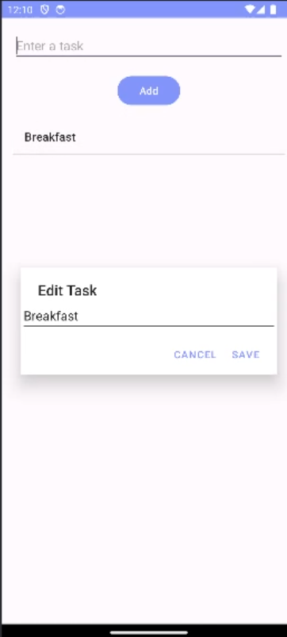
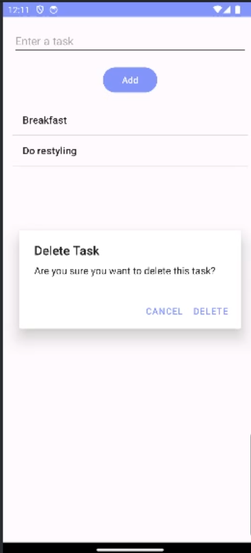

# To Do App

## Description

The To-Do App with User Authentication is a feature-rich application that helps you manage your tasks and stay organized. With user authentication, you can create a personalized account to securely store your to-do lists and access them from anywhere.

## Features

- User registration and authentication for personalized task management.
- Create, update, and delete tasks.
- Organize tasks into categories or lists.
- Mark tasks as completed or pending.
- Set due dates and reminders for tasks.
- User-friendly interface for easy task management.

## Usage

1. Launch the To-Do App on your Android device.
2. Register for an account or log in if you already have one.
3. Once logged in, you can create new tasks by tapping the "Add Task" button.

