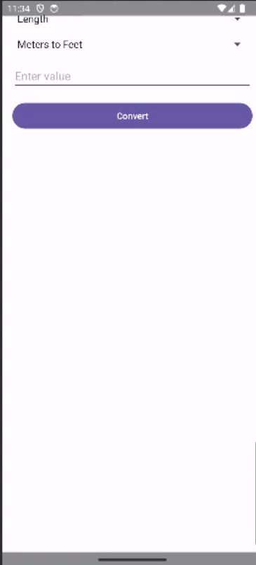

# Unit Converter Application

## Description

The Unit Converter App is a powerful tool that helps you convert between different units of measurement quickly and easily. Whether you need to convert length, time, this app has you covered.

## Features

- Convert between various units, including length, weight, volume, and temperature.
- User-friendly interface for effortless unit conversion.
- Support for both metric and imperial units.
- Real-time conversion as you type.
- Customizable unit categories for easy access.
- Search functionality to find specific units.

## Usage

1. Launch the Unit Converter App on your Android device.
2. Select the category of units you want to convert (e.g., Length, Time).
3. Choose the input unit and the output unit from the dropdown menus.
4. Enter the value you want to convert in the input field.
5. As you type, the app will provide real-time conversion results in the output field.

